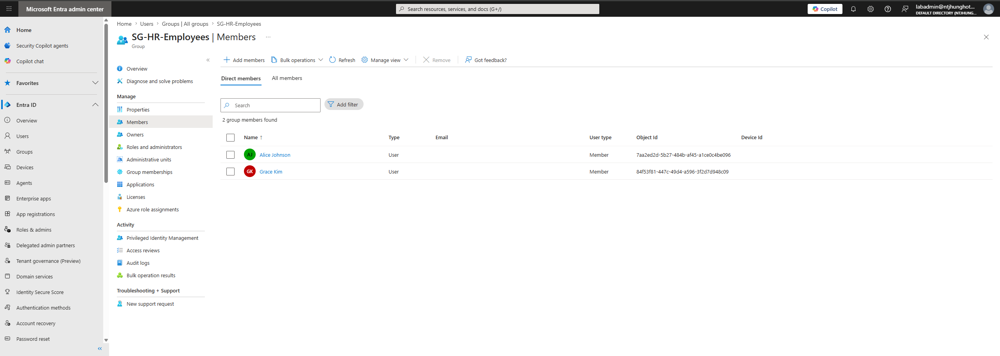
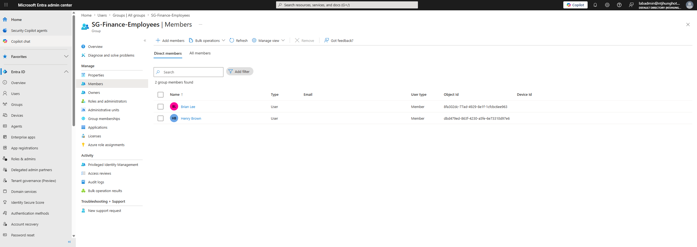
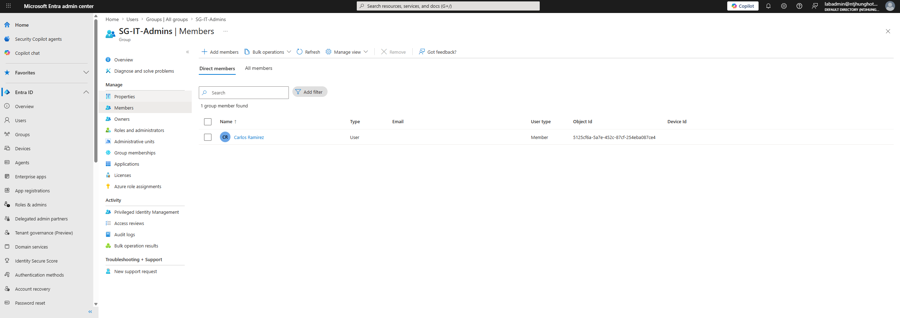
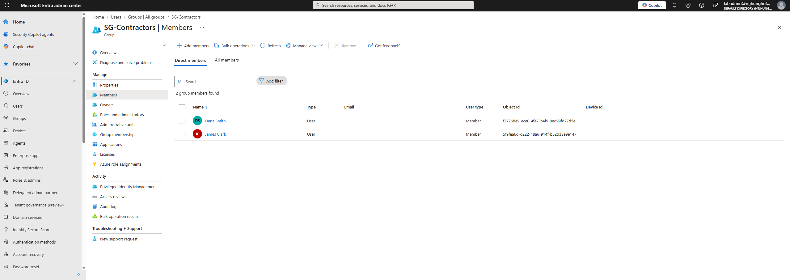

# Identity Governance Access Review Simulation

## Project Overview

This project demonstrates a manual Identity Governance access review process. The lab simulates how an IAM team can review user access, collect reviewer decisions, track remediation, and prepare audit evidence.

This project does not require Microsoft Entra ID P1 or P2 licensing. Instead of using the built-in Microsoft Entra access review feature, this lab uses a manual access review process based on group membership review, reviewer instructions, decision tracking, remediation documentation, and audit evidence.

## Business Problem

Organizations need to regularly confirm that users still require access to sensitive systems, groups, and applications. Without regular access reviews, users may keep access they no longer need, which increases security, compliance, and audit risk.

## Tools Used

- Microsoft Entra ID
- Security groups
- Group membership review
- Manual access review process
- Markdown documentation
- GitHub
- Screenshots as audit evidence

## What This Project Demonstrates

- Identity governance concepts
- Manual access review process
- Least privilege review
- Group membership review
- Reviewer decision tracking
- Access remediation planning
- Audit evidence documentation
- IAM documentation

## Groups Reviewed

The simulated access review focuses on the following groups:

- SG-HR-Employees
- SG-Finance-Employees
- SG-IT-Admins
- SG-Contractors

## Review Scope

The review evaluates whether users still need access based on:

- Department
- Job role
- Contractor status
- Privileged access risk
- Business need
- Least privilege

## Project Files

- docs/
- sample-data/
- screenshots/

## Documentation Created

- docs/Access-Review-Plan.md
- docs/Reviewer-Instructions.md
- docs/Remediation-Tracker.md
- docs/Audit-Evidence-Packet.md
- docs/Risk-Matrix.md
- sample-data/access-review-users.csv

## Lab Screenshots

### HR Group Access Review

### Finance Group Access Review

### IT Admins Access Review

### Contractors Access Review

## Key IAM Concepts Demonstrated

### Access Reviews

Access reviews help organizations confirm that users still need access to systems, groups, and applications.

### Least Privilege

Least privilege means users should only have the access required for their job responsibilities.

### Risk-Based Review

Higher-risk groups, such as IT admin, finance, and contractor groups, should be reviewed more carefully and more frequently.

### Remediation

Remediation is the process of removing, updating, or correcting access after a review decision.

### Audit Evidence

Audit evidence includes screenshots, exports, review decisions, and remediation records that prove the review was completed.

## Review Results Summary

| Decision | Count |
|---|---|
| Approve | 6 |
| Remove | 1 |
| Review Further | 1 |

## Items Requiring Follow-Up

| User | Group | Required Action |
|---|---|---|
| Carlos Ramirez | SG-IT-Admins | Validate continued need for privileged access |
| Dana Smith | SG-Contractors | Remove contractor access |

## Resume Bullet

- Built a manual identity governance access review simulation for Microsoft Entra ID groups, including reviewer instructions, access review planning, remediation tracking, least privilege analysis, and audit evidence documentation.

## Status

Completed manual identity governance access review simulation with sample review data, reviewer instructions, remediation tracking, risk matrix, audit evidence packet, and group membership screenshots.
