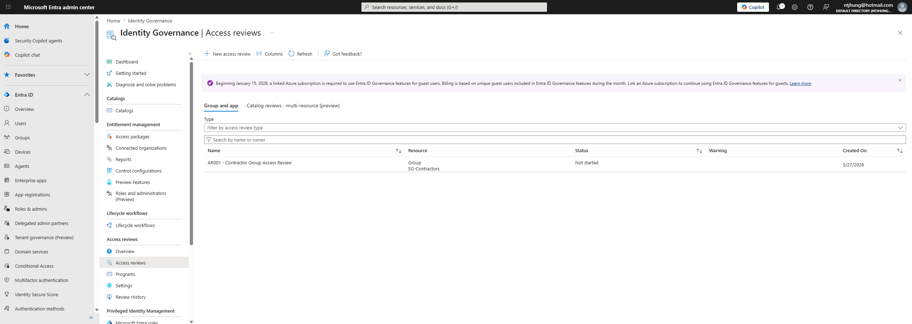
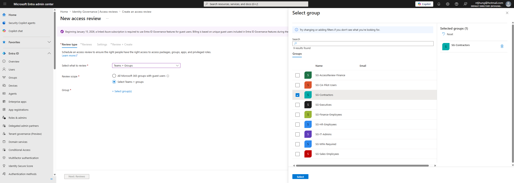
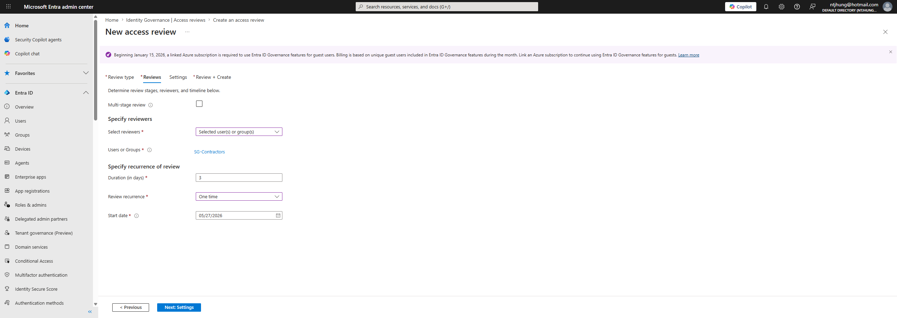
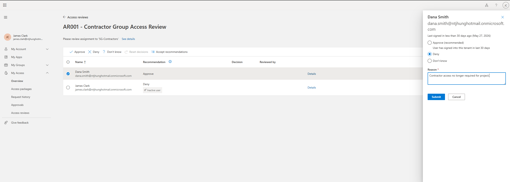
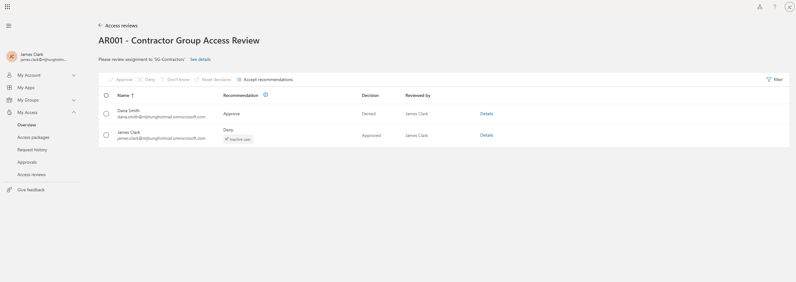
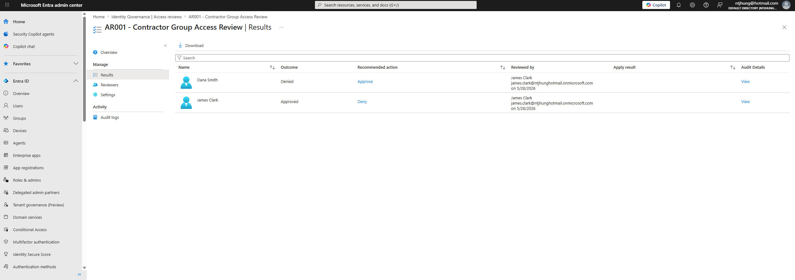
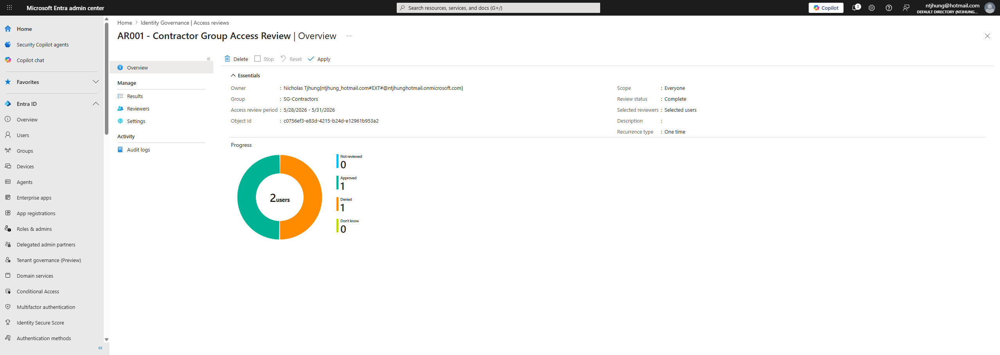

# Identity Governance Access Review Lab

## Project Overview

This project demonstrates an Identity Governance access review process using Microsoft Entra ID. The lab includes both a manual access review simulation and a live Microsoft Entra access review after Microsoft Entra ID P2 trial access was enabled.

The project simulates how an IAM team can review user access, collect reviewer decisions, track remediation, and prepare audit evidence.

## Business Problem

Organizations need to regularly confirm that users still require access to sensitive systems, groups, and applications. Without regular access reviews, users may keep access they no longer need, which increases security, compliance, and audit risk.

Contractor access is especially important to review because contractor accounts may be temporary, project-based, or time-limited.

## Tools Used

- Microsoft Entra ID
- Microsoft Entra ID P2 Trial
- Microsoft Entra Access Reviews
- Security groups
- Group membership review
- Manual access review process
- Reviewer decisions
- Remediation tracking
- Markdown documentation
- GitHub
- Screenshots as audit evidence

## What This Project Demonstrates

- Microsoft Entra access review creation
- Identity governance concepts
- Access review planning
- Contractor access review
- Reviewer decision tracking
- Approve and deny review decisions
- Remediation planning
- Least privilege review
- Group membership review
- Audit evidence documentation
- IAM documentation

## Groups Reviewed

The project focuses on reviewing access for:

- SG-Contractors
- SG-HR-Employees
- SG-Finance-Employees
- SG-IT-Admins

## Live Access Review Created

### AR001 - Contractor Group Access Review

This access review was created to review membership in the contractor access group.

Review purpose:

- Confirm whether contractor users still require access
- Identify contractor access that should be removed
- Document reviewer decisions
- Support least privilege and audit readiness

Example review decisions:

| User | Decision | Reason |
|---|---|---|
| Dana Smith | Deny / Remove | Contractor access no longer required for project |
| James Clark | Approve | Temporary project access still required |

## Manual Review Scope

The manual access review simulation evaluates whether users still need access based on:

- Department
- Job role
- Contractor status
- Privileged access risk
- Business need
- Least privilege

## Project Files

- docs/
- sample-data/
- screenshots/

## Documentation Created

- docs/Access-Review-Plan.md
- docs/Reviewer-Instructions.md
- docs/Remediation-Tracker.md
- docs/Audit-Evidence-Packet.md
- docs/Risk-Matrix.md
- sample-data/access-review-users.csv

## Lab Screenshots

### Access Review Created

### Access Review Settings

### Access Review Reviewers

### Access Review Decisions

### Access Review Completed

### Access Review Results

### Apply Results Screen

### Finance Group Access Review

### IT Admins Access Review

### Contractors Access Review

## Key IAM Concepts Demonstrated

### Access Reviews

Access reviews help organizations confirm that users still need access to systems, groups, and applications.

### Identity Governance

Identity Governance helps manage access over time through reviews, approvals, remediation, and audit evidence.

### Least Privilege

Least privilege means users should only have the access required for their job responsibilities.

### Contractor Access Review

Contractor access should be reviewed regularly because it is often temporary or project-based.

### Remediation

Remediation is the process of removing, updating, or correcting access after a review decision.

### Audit Evidence

Audit evidence includes screenshots, exports, review decisions, and remediation records that prove the review was completed.

## Review Results Summary

| Decision | Count |
|---|---|
| Approve | 1 |
| Deny / Remove | 1 |

## Items Requiring Follow-Up

| User | Group | Required Action |
|---|---|---|
| Dana Smith | SG-Contractors | Remove contractor access |
| James Clark | SG-Contractors | Keep temporary access |

## Resume Bullet

- Built a Microsoft Entra Identity Governance access review lab with live access review creation, contractor group review, reviewer decisions, remediation tracking, least privilege analysis, and audit evidence documentation.

## Status

Completed Microsoft Entra Identity Governance access review lab with live access review screenshots, manual review documentation, remediation tracking, risk matrix, audit evidence packet, and group membership evidence.
